## Temporal LiDAR Frame Prediction for Autonomous Driving

### Additional Flow Visualizations

Red points are from t and green points are from t+1. The magnitude of the vectors are visualized on this scale:

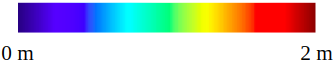

**Scene 1**
In this scene, the ego vehicle is driving past a full parking lot. The images show the predicted motion vectors of the parked cars. Here PN++ w/ DS outperforms  the other architectures, producing smooth, accurate flow for the cars. EC w/ DS also performs reasonably well. 

FN3DOOB

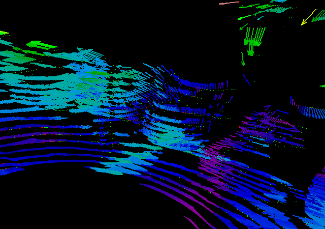

FN3DA

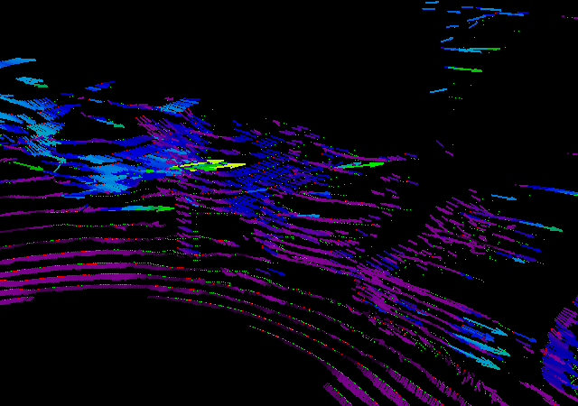

PN++ w/ DS

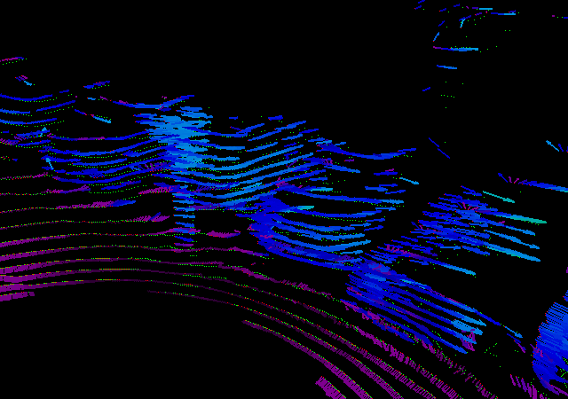

PN++ w/o DS

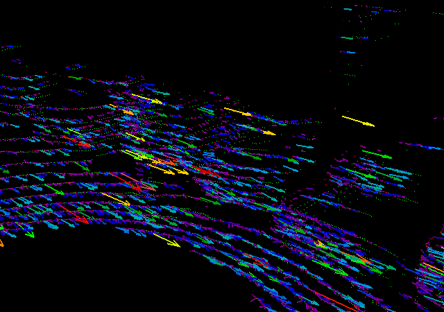

EC w/ DS

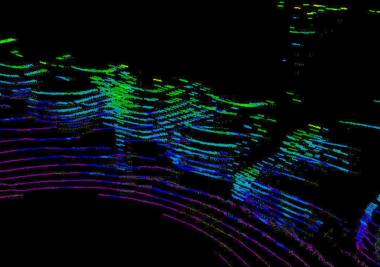

EC w/o DS

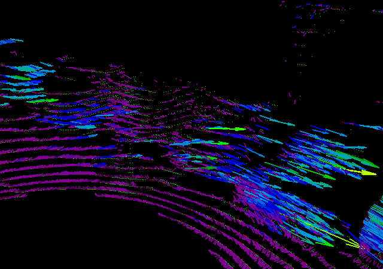

**Scene 2**
In this scene, the ego vehicle is moving forward, and there is a car behind it travelling at about the same velocity. This car is at the bottom left of the images. PN++ w/ DS, EC w/ DS, and EC w/o DS are able to capture the global movement of the scene, while also predicting that the car moves independently from the rest of the scene ie. it stays still relative to the ego vehicle's coordinate frame. 

FN3DOOB

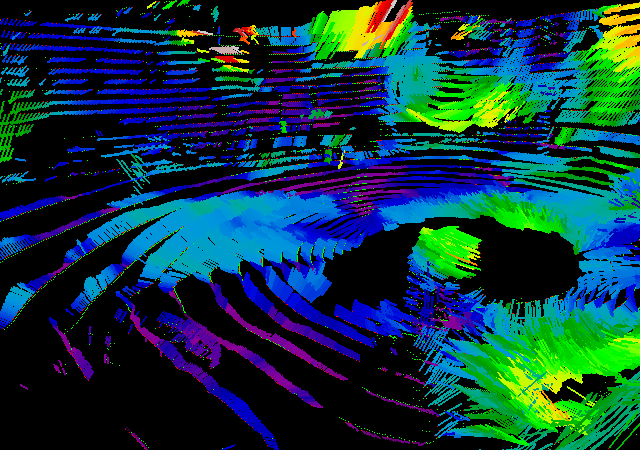

FN3DA

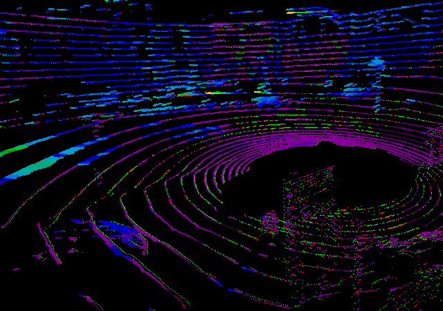

PN++ w/ DS

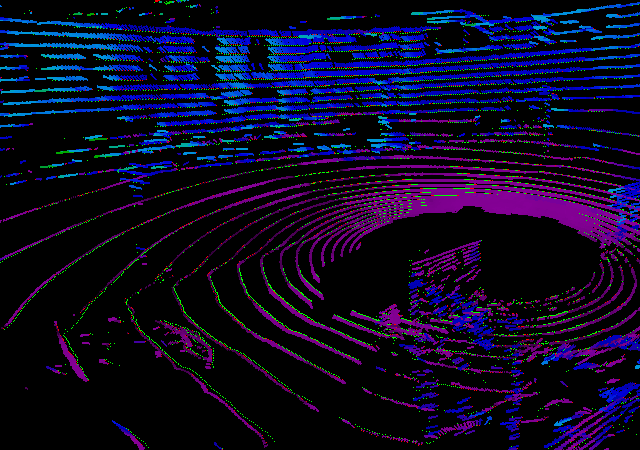

PN++ w/o DS

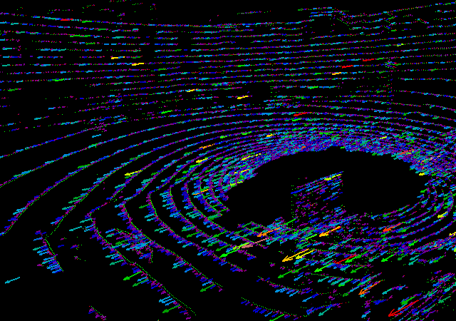

EC w/ DS

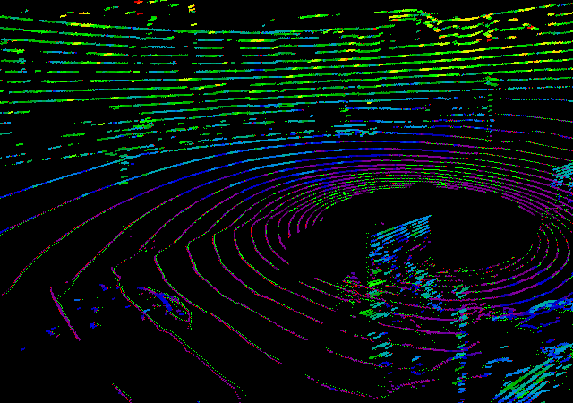

EC w/o DS

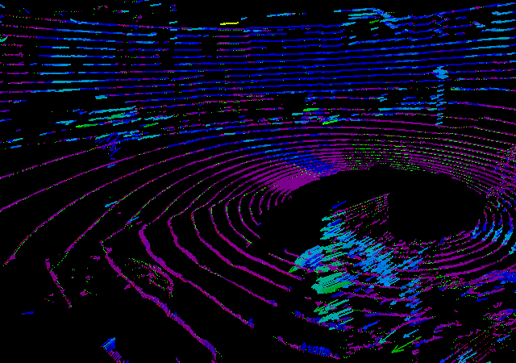
